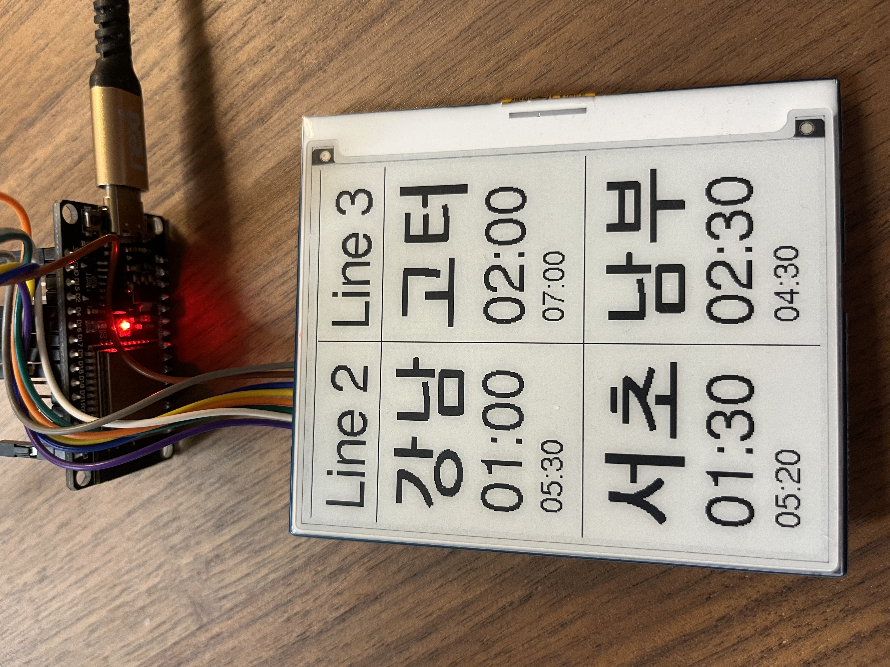

# 교대역 Arrivals board for ESP32/4.2" E-ink display.

- Compile and upload to an ESP32 dev board rigged up to an e-ink display.

- When
it cannot connect to wifi, a network named `LiveStationMonitorWifiSetup` will
be broadcast and you can connect that way.

- In the future I may add the ability
to choose the station using that dialogue, but for now since this is for
personal use, it is hardcoded.

